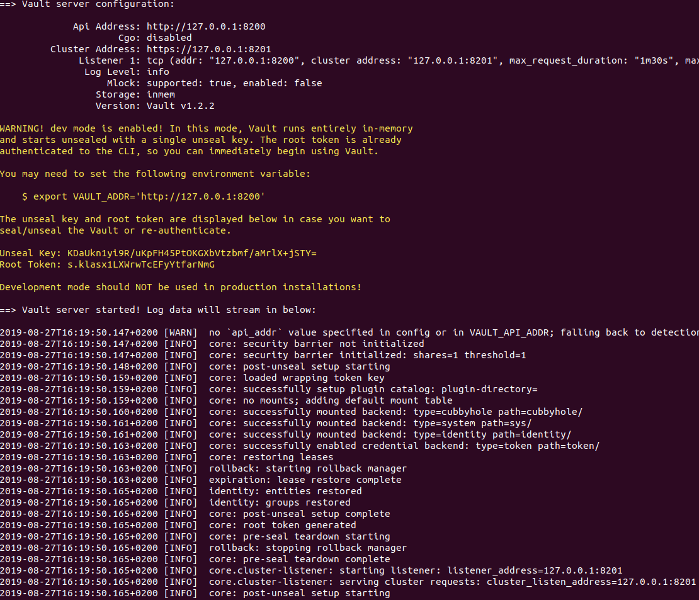
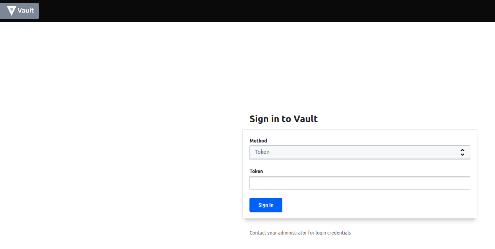
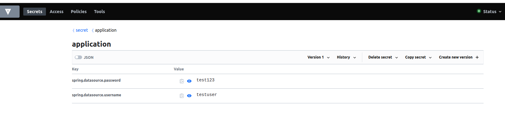

# springboot-vault-demo
This demo explains how to use vault in spring boot.

### HashiCorp Vault 
> **Manage Secrets and Protect Sensitive Data**
> Secure, store and tightly control access to tokens, passwords, certificates, encryption keys for protecting secrets and other sensitive data using a UI, CLI, or HTTP API.

### Installation 

Refer the link https://www.vaultproject.io/downloads.html

### Start Vault

```
vault server -dev -dev-root-token-id=<token value>

```
### Set Environment Variable

```
export VAULT_ADDR='http://127.0.0.1:8200'

```

### Screenshot





### Store vaules

I am storing username and password for H2 database in the Vault.



### How to configure HashiCorp Vault in Spring Boot

I have taken the H2 database connection as an example where i am storing username and password in secret vault.

To connect Vault in Springboot, we need to create bootstrap.yml under resources folder and do the vault configuration.

**_bootstrap.yml_**

```
spring:
  cloud:
    vault:
      scheme: http
      host: localhost
      port: 8200
      connection-timeout: 5000
      read-timeout: 15000
      authentication: token
      token: 12345-6789-0000
      kv:
        enabled: true
      generic:
        enabled: false
```

**_application.properties_**

```
spring.datasource.url=jdbc:h2:mem:demo;DB_CLOSE_DELAY=-1;DB_CLOSE_ON_EXIT=FALSE
spring.datasource.username= test
spring.datasource.password= test
spring.jpa.database-platform= org.hibernate.dialect.H2Dialect
server.port=8085

```
**_DemoController.java_**

```
@RestController
public class DemoController {

    @Value("${spring.datasource.username}")
    private String username;

    @Value("${spring.datasource.password}")
    private String password;

    @Autowired
    private DataSource dataSource;

    @GetMapping("/demo")
    public String getConnection() throws SQLException {
        return username + " and " + password + " from vault and connected to  database " +  dataSource.getConnection();
    }
}

```

Here @Value("${**spring.datasource.username**}") retrieved from the **Vault**.

### Output


### Happy Coding